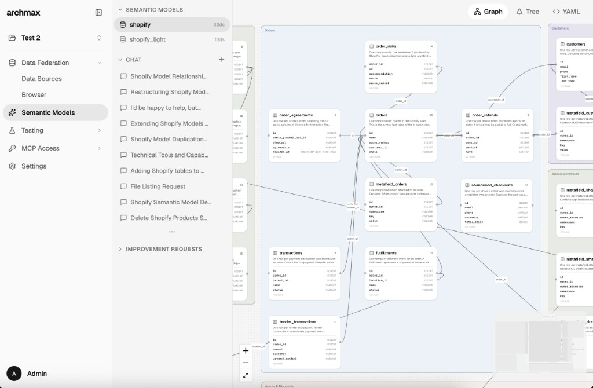
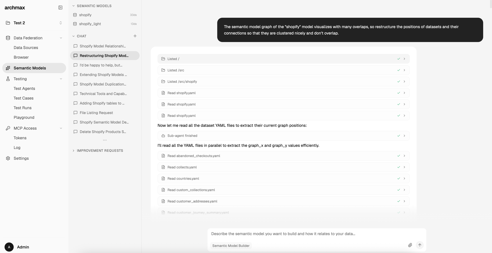
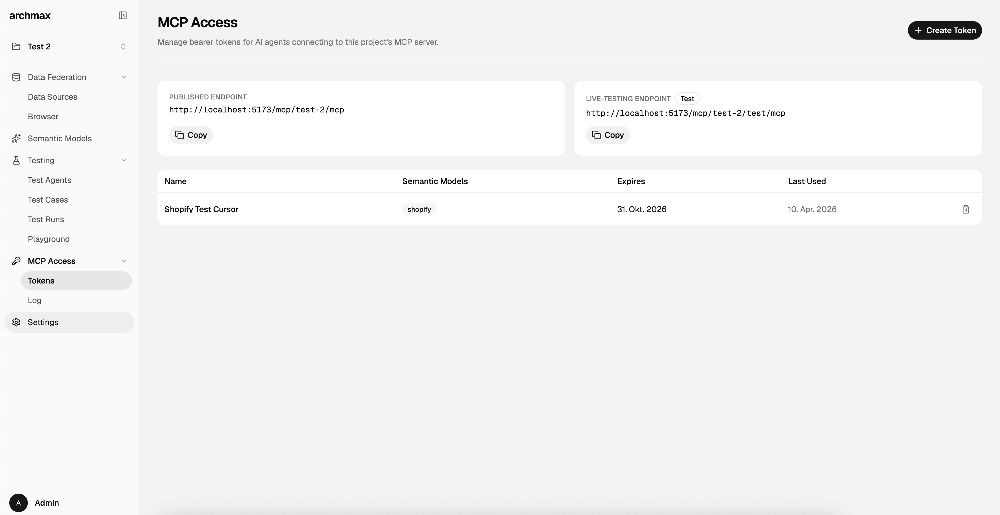
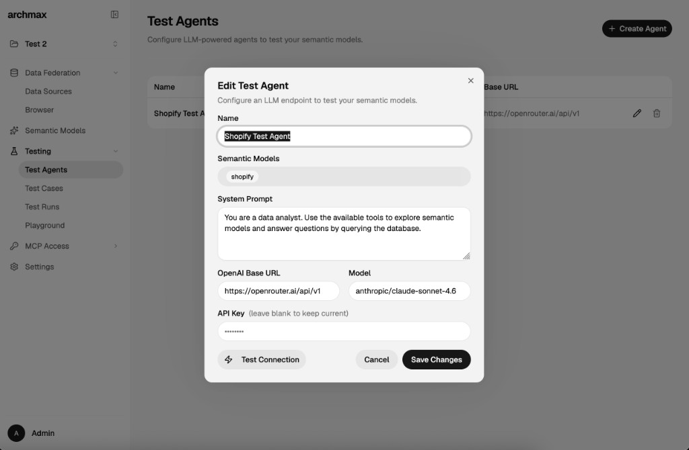
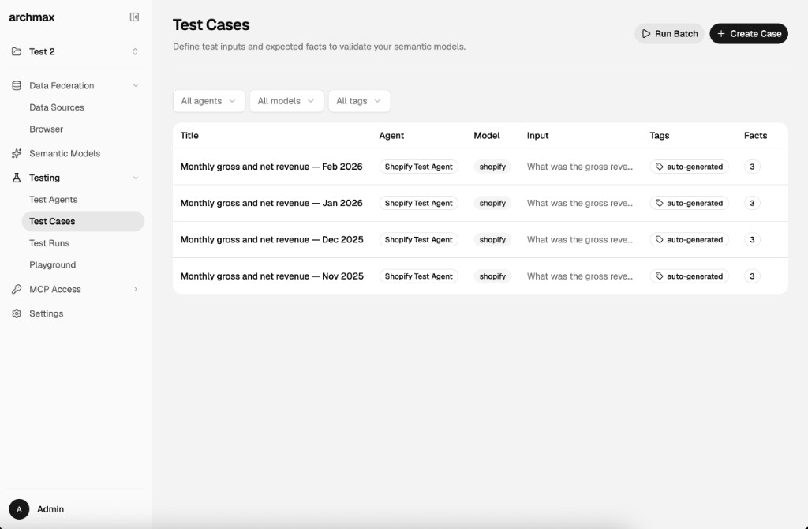
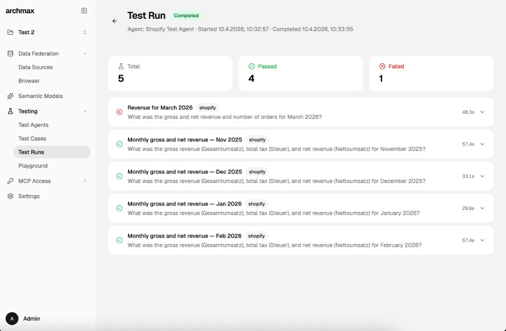

# archmax

A semantic layer for your data: archmax describes it, you sharpen it, AI agents query it.

<p align="center">
  <a href="https://docs.archmax.ai"><strong>Documentation</strong></a> &nbsp;&middot;&nbsp;
  <a href="https://github.com/archmaxai/archmax/issues"><strong>Issues</strong></a> &nbsp;&middot;&nbsp;
  <a href="https://github.com/archmaxai/archmax"><strong>GitHub</strong></a>
</p>

> **Heads up: archmax is experimental.** The core ideas are stable, but APIs, file formats, and configuration may change between releases. We try to avoid breaking changes, but can't guarantee stability yet. Pin your version and check the changelog before upgrading.

Built on the **[Open Semantic Interchange (OSI)](https://github.com/open-semantic-interchange/OSI)** spec, an open standard for describing datasets, relationships, and metrics in a vendor-neutral way. archmax is the runtime that turns OSI models into a live, queryable semantic layer for AI agents.

<table>
<tr>
<td width="33%"></td>
<td width="33%"></td>
<td width="33%"></td>
</tr>
<tr>
<td align="center"><b>Graph View</b></td>
<td align="center"><b>Model Builder</b></td>
<td align="center"><b>MCP Access</b></td>
</tr>
<tr>
<td width="33%"></td>
<td width="33%"></td>
<td width="33%"></td>
</tr>
<tr>
<td align="center"><b>Test Agents</b></td>
<td align="center"><b>Test Cases</b></td>
<td align="center"><b>Test Runs</b></td>
</tr>
</table>

## The Problem

Connecting AI agents to databases today is a gamble. You either hand over raw SQL access and hope the LLM doesn't hallucinate column names, run destructive queries, or leak sensitive data, or you spend weeks writing bespoke tool integrations that break the moment your schema changes.

Even when agents *can* query your database, they have no idea what the data actually means. A column called `amt_01` could be revenue, tax, or a refund. A table called `dim_cust` is meaningless without business context. Without that context, agents guess, and guessing on real data has real consequences.

The gap between "AI can write SQL" and "AI understands our data" is where most agent-database projects stall.

## How archmax Solves This

archmax puts a **semantic layer** between your databases and AI agents. Archmax describes your data; you sharpen it with the context that matters; agents query through the [Model Context Protocol (MCP)](https://modelcontextprotocol.io/).

Instead of raw database access, agents get:

- **Business context**: field descriptions, synonyms, examples, and enum values so the agent knows `amt_01` is "gross revenue in EUR"
- **Guardrails**: read-only queries scoped to sandboxed VIEWs, not raw tables; token-based access with model-level permissions
- **Federation**: a single query interface across Postgres, MySQL, MSSQL, SQLite, and DuckDB, powered by DuckDB's in-process engine
- **Structure**: typed datasets, explicit relationships, and reusable metric definitions grounded in the OSI spec

The result: AI agents that query your data reliably, safely, and with understanding, not guesswork.

## Features

- **Semantic Models**: describe tables as datasets with typed fields, relationships, and metrics in YAML
- **MCP Server**: expose your semantic layer to any MCP-compatible AI agent (Claude, Cursor, custom agents)
- **Data Federation**: query across Postgres, MySQL, MSSQL, SQLite, and DuckDB from a single project
- **AI-Assisted Model Builder**: a chat-based agent discovers schemas, maps fields, detects enums, and infers relationships
- **Scoped Query Execution**: agents run read-only SQL against sandboxed VIEWs, never raw tables
- **Token-Based Access Control**: MCP tokens with configurable model scopes and expiry
- **Testing Suite**: test cases that validate whether agents can use your semantic models correctly
- **Self-Hosted**: deploy with Docker in minutes, keep your data on your infrastructure

## Quick Start

### Docker (Standalone)

Run archmax as a single container with embedded MongoDB and Redis:

```bash
docker run -d \
  --name archmax \
  -p 8080:8080 \
  -e BETTER_AUTH_SECRET=$(openssl rand -base64 32) \
  -e UI_USERNAME=admin \
  -e UI_PASSWORD=changeme \
  -e AGENT_API_KEY=your-openrouter-api-key \
  -v ~/.archmax:/data \
  ghcr.io/archmaxai/archmax:latest
```

> **Volume mount:** The `-v ~/.archmax:/data` bind mount persists all application data on the host — semantic model YAML files (`projects/`), embedded MongoDB data (`mongodb/`), and the DuckDB extension cache (`.duckdb/`). Without this mount, all data is lost when the container is removed.

> **Save your `BETTER_AUTH_SECRET`.** If you lose this value or change it on a restart, all sessions and authentication data become invalid. Generate it beforehand and store it in a safe place.

> **`AGENT_API_KEY` is required for AI features.** The Semantic Model Builder, Testing Playground, and automatic title generation all need an API key for an OpenAI-compatible provider. The default endpoint is [OpenRouter](https://openrouter.ai). Without this key, agent features will be unavailable.

Open `http://localhost:8080` and log in with username `admin` (or your `UI_USERNAME`) and the password you set in `UI_PASSWORD`.

### Docker Compose (Recommended for Production)

Runs archmax with dedicated MongoDB and Redis containers instead of the embedded services:

```bash
# 1. Clone the repo (or copy docker-compose.yml + .env.example)
git clone https://github.com/archmaxai/archmax.git
cd archmax

# 2. Create your .env from the example and fill in the required values
cp .env.example .env

# 3. Start the stack
docker compose up -d
```

The `.env` file needs at minimum:

```bash
BETTER_AUTH_SECRET=<random-32+-char-secret>   # openssl rand -base64 32
UI_PASSWORD=<your-admin-password>
AGENT_API_KEY=<your-openrouter-api-key>       # required for AI features
```

Optional overrides (defaults shown):

| Variable | Default |
|----------|---------|
| `UI_USERNAME` | `admin` |
| `AGENT_API_BASE_URL` | `https://openrouter.ai/api/v1` |
| `AGENT_MODEL` | `anthropic/claude-sonnet-4.6` |

The stack exposes port **8080** and persists data in two Docker volumes:

| Volume | Container Path | Contents |
|--------|---------------|----------|
| `archmax-data` | `/data` | Semantic model YAML files, DuckDB extension cache |
| `mongo-data` | `/data/db` (mongo container) | MongoDB database files |

These volumes are created automatically by Docker Compose. To use host bind mounts instead, edit `docker-compose.yml` and replace the named volumes with paths (e.g. `./data/archmax:/data`).

### Local Development

```bash
git clone https://github.com/archmaxai/archmax.git
cd archmax
cp .env.example .env.local   # Edit with your settings
pnpm install
pnpm dev
```

| Service | URL |
|---------|-----|
| Frontend | http://localhost:5173 |
| API | http://localhost:3000 |
| Docs | http://localhost:4321 |
| MCP | `POST http://localhost:3000/mcp/<project-slug>/mcp` |

## Architecture

```
archmax/
├── apps/
│   ├── api/          # Hono API server
│   ├── frontend/     # Vite + React SPA (TanStack Router)
│   ├── worker/       # BullMQ worker for agent jobs
│   └── docs/         # Documentation site (Astro Starlight)
├── packages/
│   ├── core/         # Shared models, services, config (@archmax/core)
│   └── ui/           # React UI components (@archmax/ui)
└── openspec/         # Specifications and change proposals
```

**Tech stack:** TypeScript, Hono, React 19, Vite 6, MongoDB, DuckDB, Tailwind CSS 4, Turborepo

## MCP Tools

| Tool | Description |
|------|-------------|
| `list_semantic_models` | List semantic models the token has access to |
| `get_semantic_model` | Overview of a model with datasets, relationships, and metrics |
| `get_datasets` | Fields for one or more datasets with types, examples, enums, and instructions |
| `execute_query` | Run a read-only SQL query scoped to a semantic model's VIEWs |
| `request_improvement` | Submit an improvement request for a semantic model |

### Connecting an AI Agent

Configure your MCP client with:

- **Endpoint:** `https://your-server/mcp/<project-slug>/mcp`
- **Auth:** `Bearer <your-mcp-token>`

```json
{
  "mcpServers": {
    "archmax": {
      "url": "https://your-server/mcp/your-project/mcp",
      "headers": {
        "Authorization": "Bearer sk-your-token"
      }
    }
  }
}
```

## Configuration

Key environment variables (see `.env.example` for the full list):

| Variable | Description |
|----------|-------------|
| `BETTER_AUTH_SECRET` | Session encryption secret (min 32 chars). Save and reuse across restarts. |
| `UI_USERNAME` / `UI_PASSWORD` | Initial admin credentials (default username: `admin`) |
| `MONGODB_URI` | MongoDB connection string (optional in Docker; embedded when omitted) |
| `AGENT_API_BASE_URL` | OpenAI-compatible API endpoint (default: OpenRouter) |
| `AGENT_API_KEY` | API key for the AI agent (required for agent features) |
| `AGENT_MODEL` | LLM model identifier (e.g., `anthropic/claude-sonnet-4`) |
| `REDIS_URL` | Optional. Enables BullMQ worker queue (embedded in Docker when omitted) |

## Contributing

archmax uses [OpenSpec](https://github.com/nicholasgriffintn/openspec) for spec-driven development. **Every feature PR must include a corresponding spec change.**

### Setup

```bash
npm install -g openspec-cli
```

### Workflow

OpenSpec integrates with your AI coding assistant. Use these prompts in Cursor (or any OpenSpec-aware agent):

| Prompt | What it does |
|--------|-------------|
| `/openspec-proposal` | Scaffolds a new change proposal with `proposal.md`, `tasks.md`, and spec deltas |
| `/openspec-apply` | Implements an approved proposal by following the task checklist |
| `/openspec-archive` | Archives a completed change and updates specs |

The typical flow:

1. **Propose** — Run `/openspec-proposal` and describe the change. The agent creates the proposal directory, writes spec deltas, and validates with `openspec validate <change-id> --strict`.
2. **Review** — Get the proposal approved before any code is written.
3. **Implement** — Run `/openspec-apply` to work through the task list.
4. **Archive** — After merging, run `/openspec-archive` to move the change to the archive and update the canonical specs.

You can also drive the workflow manually with the CLI (`openspec list`, `openspec show`, `openspec validate`, `openspec archive`). See `openspec/AGENTS.md` for the full reference.

See the [Contributing guide](apps/docs/src/content/docs/contributing/openspec.mdx) for details.

## License

[AGPL-3.0](LICENSE)
